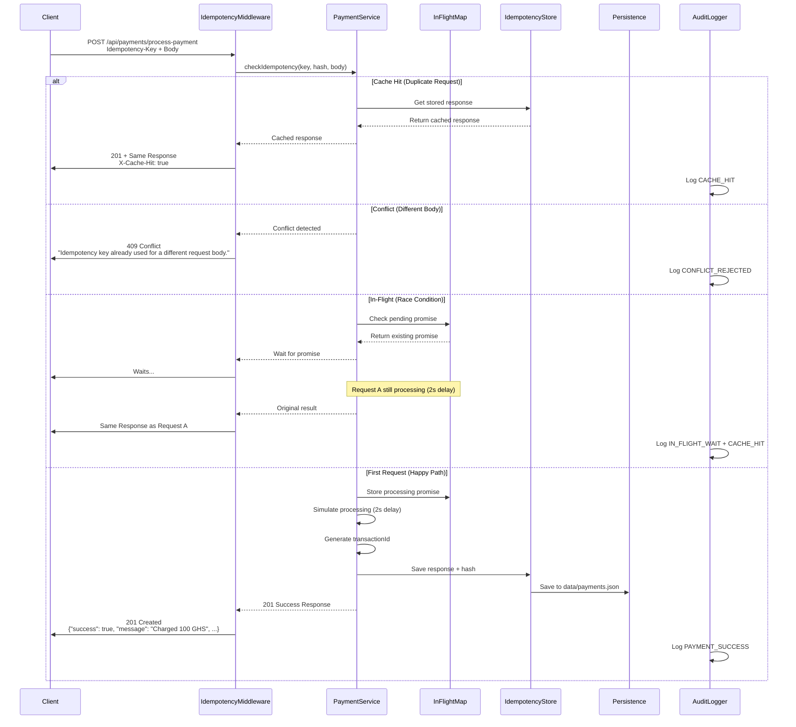
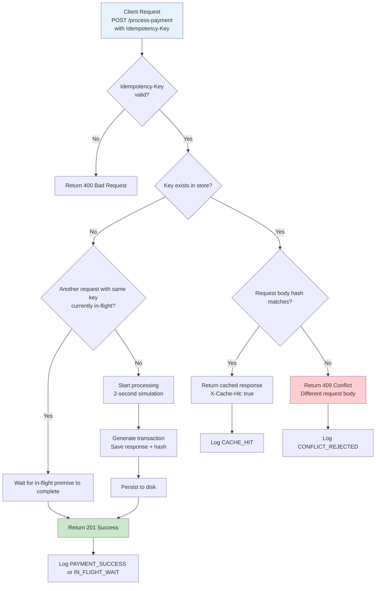

# Idempotency-Gateway (The "Pay-Once" Protocol)

A robust, production-ready idempotency layer for payment processing built with **Node.js + TypeScript + Express**.  
This solution ensures that **no matter how many times the same request is sent with the same `Idempotency-Key`**, the payment is processed **exactly once**, preventing double-charging and building strong customer trust.

**Client**: FinSafe Transactions Ltd.  
**Goal**: Eliminate double-charging caused by network retries in e-commerce payments.

---

## Architecture Diagrams

### 1. Sequence Diagram (Detailed Logic Flow)



### 2. Flowchart (High-Level Decision Flow)



---

## Setup Instructions

### 1. Install Dependencies (2026 recommended)
```bash
npm install
```

### 2. Environment Setup
```bash
cp .env.example .env
```

### 3. Run the Server
```bash
npm run dev
```
or
```bash
npm run dev:nodemon
```

Server runs on `http://localhost:3200`.

### 4. Test Easily with Postman
[Postman Collection Invite Link](https://app.getpostman.com/join-team?invite_code=b0f9d1acef8bcc740dee422e70b1c7895b16fed04f63d6b5109c351a27aa4d78&target_code=c2fa35e11aa44a64d4418a9ed130d41b)

---

## API Documentation

All endpoints return `X-Request-ID` header for tracing.  
Error responses use secure, user-friendly messages (no internal details leaked).

### Authentication Endpoints

#### 1. Register User
**POST** `/api/auth/register`

**Body:**
```json
{
  "name": "finsafe",
  "email": "finsafe@example.com",
  "password": "pass1234"
}
```

**Success (201 Created)**
```json
{
  "success": true,
  "message": "Account created successfully. You can now log in.",
  "user": { "id": "...", "name": "...", "email": "...", "createdAt": "..." }
}
```

**Errors:**
- `400` – Validation failed (e.g., invalid email, short password)
- `400` – "User with this email already exists."

#### 2. Login User
**POST** `/api/auth/login`

**Body:**
```json
{
  "email": "finsafe@example.com",
  "password": "pass1234"
}
```

**Success (200 OK)**
```json
{
  "success": true,
  "message": "Login successful.",
  "token": "eyJ...",
  "user": { "id": "...", "name": "...", "email": "...", "createdAt": "..." }
}
```

**Errors:**
- `400` – Validation failed
- `401` – "Invalid credentials."

#### 3. Get Current User
**GET** `/api/auth/me`

**Headers:**
- `Authorization: Bearer <token>`

**Success (200 OK)**
```json
{
  "success": true,
  "message": "User profile retrieved successfully.",
  "user": { "id": "...", "name": "...", "email": "...", "createdAt": "..." }
}
```

**Errors:**
- `401` – "Access token required." / "Invalid or expired token."

---

### Payment Endpoint (Core Idempotency)

#### Process Payment
**POST** `/api/payments/process-payment`

**Headers:**
- `Authorization: Bearer <jwt-token>`
- `Idempotency-Key: <unique-string>` (required, 8–128 characters)

**Body:**
```json
{
  "amount": 100,
  "currency": "GHS"
}
```

**Success – First Request (201 Created)**
```json
{
  "success": true,
  "message": "Charged 100 GHS",
  "transactionId": "txn_1...",
  "amount": 100,
  "currency": "GHS"
}
```

**Success – Duplicate Request (201 Created)**
- Exact same body as first request
- Header: `X-Cache-Hit: true`

**Errors:**
- `400` – "Idempotency-Key header is required for this endpoint." or validation error
- `401` – Unauthorized
- `409` – "Idempotency key already used for a different request body."
- `429` – Rate limit exceeded

---

### Audit Endpoint (Developer's Choice)

#### Get Audit Logs
**GET** `/api/payments/audit`

**Headers:**
- `Authorization: Bearer <jwt-token>`

**Query Parameters (optional):**
- `key` – Filter by idempotencyKey
- `userId` – Filter by userId

**Success (200 OK)**
```json
{
  "success": true,
  "message": "Audit logs retrieved successfully.",
  "count": 5,
  "audits": [ ... ],
  "requestId": "..."
}
```

**Errors:**
- `401` – Unauthorized
- `500` – "Internal server error"

Audit events include: `PAYMENT_PROCESSING_STARTED`, `CACHE_HIT`, `CONFLICT_REJECTED`, `IN_FLIGHT_WAIT`, `PAYMENT_SUCCESS`, `IDEMPOTENCY_CHECK`, etc.

---

## Design Decisions

- **Hybrid Storage**: In-memory `Map` for speed + JSON file persistence for durability.
- **SHA-256 Request Hashing**: Guarantees data integrity (User Story 3).
- **In-Flight Promise Handling**: Safely manages concurrent requests without race conditions (Bonus User Story).
- **Zod + TypeScript**: Strong validation and type safety.
- **Security Layers**: Helmet, rate limiting, secure messages, JWT authentication.
- **Audit Logging**: Full observability for every idempotency event.

These decisions make the system fast, safe, retry-friendly, and production-ready.

---

## The Developer's Choice: Audit Logging System

I added a **complete audit logging system** using Pino with automatic JSON persistence (`data/audit.json`).

**Why this feature?**  
In fintech, transparency builds trust. Merchants and customers feel confident knowing every payment attempt is recorded (CACHE_HIT, CONFLICT_REJECTED, IN_FLIGHT_WAIT, SUCCESS, etc.) with requestId and outcome. This reduces churn, supports compliance, and gives developers full visibility — all while keeping logs clean and secure.

This turns a simple idempotency solution into a professional payment safety platform that FinSafe can confidently offer to its clients.

Audits can be accessed either by the api endpoint or in the data/audits.json file.

---

## Pre-Submission Checklist (All Passed ✅)

- Public repository
- Clean code (no unnecessary files or secrets)
- Server starts with `npm run dev`
- Both architecture diagrams included
- Detailed API documentation for all endpoints
- Postman collection link
- Developer's Choice fully implemented and documented
- Secure practices applied throughout

Built with care to prevent double-charging and deliver peace of mind in every transaction.

**Nana Ameyaw** – Full Stack Developer  
March 2026
```

**Perfect!**  
